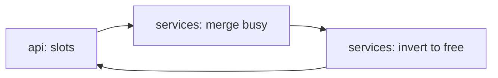

# agent-cal-scheduling

[](https://github.com/Shamanchi/agent-cal-scheduling/actions/workflows/ci.yml)
[](https://www.python.org/)
[](./Dockerfile)
[](./LICENSE)

> **English TL;DR:** FastAPI scheduling agent: intersect attendees' busy intervals within work hours and return common free slots fitting the meeting duration. Pure interval math, fully offline.

Агент планирования встреч: пересекает занятость участников в рабочее время и возвращает общие свободные слоты под длительность встречи. Чистая математика интервалов, офлайн.

Источник темы: `Hands-On-AI-Engineering / P-114 (cal_scheduling_agent)` — идею и постановку взяли из каталога, код и тексты написаны с нуля.

## Какую задачу решает

Собрать созвон без долгой переписки: агент принимает занятость участников, рабочие часы и длительность — и отдаёт слоты, свободные у всех.

## Архитектура



Слои: `api/` → `services/` → `core/`, настройки через `pydantic-settings`.

## Быстрый старт

```bash
cp .env.example .env
pip install -r requirements.txt
uvicorn app.main:app --reload
curl -X POST http://127.0.0.1:8000/api/v1/slots -H "Content-Type: application/json" -d "{\"day\": \"2026-09-22\", \"duration_min\": 30, \"attendees\": [{\"name\": \"Ann\", \"busy\": [{\"start\": \"2026-09-22T10:00\", \"end\": \"2026-09-22T11:00\"}]}]}"
```

Docker:

```bash
docker compose up --build
```

## API

- `GET /api/v1/health` — проверка сервиса.
- `POST /api/v1/slots` — свободные слоты. Тело: `{"day": "2026-09-22", "duration_min": 30, "work_start": "09:00", "work_end": "18:00", "attendees": [{"name": "Ann", "busy": [{"start": "...", "end": "..."}]}]}`.

Пример ответа `slots` (сокращённо):

```json
{
  "day": "2026-09-22",
  "slots": [{"start": "2026-09-22T09:00", "end": "2026-09-22T10:00"}]
}
```

## Переменные окружения (.env)

| Переменная | Назначение | По умолчанию |
|---|---|---|
| `WORK_START` | Начало рабочего дня | `09:00` |
| `WORK_END` | Конец рабочего дня | `18:00` |
| `APP_HOST` / `APP_PORT` | Хост/порт API | `0.0.0.0` / `8000` |

Полный список — в [.env.example](./.env.example).

## Тесты

```bash
pip install -r requirements.txt
pytest -q
pytest -q -m integration
```

Unit-тесты без сети. Интеграционные (`-m integration`) — через TestClient, тоже без сети.

## Контакты

- Telegram: @PavelYrevichh
- Email: Lietman46@mail.ru
- GitHub: Shamanchi
- FL.ru: https://www.fl.ru/users/Shamanchi
